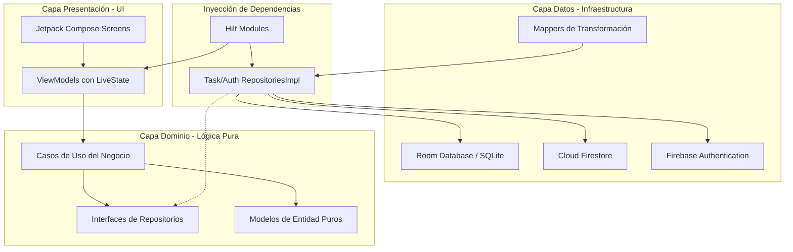
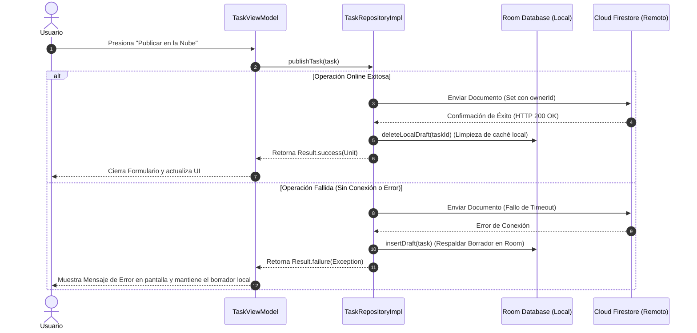

# Documentación Complementaria de Ingeniería - Gestor de Tareas

Este documento contiene los diagramas arquitectónicos, el modelo de datos detallado, la matriz de pruebas funcionales ejecutadas y el guion técnico detallado para la sustentación del proyecto.

---

## 📊 1. Diagramas de Arquitectura y Flujos

### Flujo de Capas (Clean Architecture)
El siguiente diagrama detalla cómo fluyen las dependencias hacia el centro de la aplicación, garantizando el aislamiento absoluto del dominio:

### Flujo de Publicación Segura (RF08)
Este diagrama ilustra la estrategia de tolerancia a fallos implementada al guardar o publicar una tarea:

---

## 🗃️ 2. Modelo de Datos y Esquemas

### A. Almacenamiento Remoto (Cloud Firestore)
* **Colección:** `tasks`
* **Tipo de Documento:** Identificador Alfanumérico aleatorio generado por Firebase.
* **Campos internos:**

| Nombre del Campo | Tipo de Datos | Descripción / Regla |
| :--- | :--- | :--- |
| `title` | `String` | Título de la tarea obligatoria ingresado por el usuario. |
| `description` | `String` | Texto descriptivo detallado opcional. |
| `ownerId` | `String` | UID del usuario autenticado (`request.auth.uid`). Filtro perimetral obligatorio. |
| `createdAt` | `Long` | Timestamp en milisegundos para ordenamiento descendente. |

### B. Almacenamiento Local (Room Database)
* **Tabla:** `task_drafts`
* **Esquema de la Entidad:**

| Nombre de Columna | Atributo Base | Tipo en SQLite | Descripción |
| :--- | :--- | :--- | :--- |
| `id` | `@PrimaryKey` | `TEXT` | UUID único auto-generado localmente de forma aleatoria. |
| `title` | `Field` | `TEXT` | Título del borrador. |
| `description` | `Field` | `TEXT` | Descripción del borrador. |
| `ownerId` | `Field` | `TEXT` | UID del dueño de la sesión para evitar mezclar borradores en dispositivos multiusuario. |
| `createdAt` | `Field` | `INTEGER` | Fecha de creación del borrador local. |

---

## 🧪 3. Matriz de Registro de Pruebas Ejecutadas (Caja Negra)

| ID Prueba | Módulo / Pantalla | Descripción del Caso de Prueba | Entrada Suministrada | Resultado Esperado | Estado (Pasa / Falla) |
| :--- | :--- | :--- | :--- | :--- | :--- |
| **TC-01** | Registro | Validar formato inválido de correo | Correo: `juan#sena`, Clave: `123456` | Alerta: "El formato del correo electrónico no es válido." | **PASA** |
| **TC-02** | Registro | Validar longitud de clave menor a 6 | Correo: `alfa@sena.edu.co`, Clave: `123` | Alerta: "La contraseña debe tener al menos 6 caracteres." | **PASA** |
| **TC-03** | Registro | Validar contraseñas no coincidentes | Clave: `sena123`, Confirmar: `sena456` | Alerta: "Las contraseñas no coinciden." | **PASA** |
| **TC-04** | Login | Autenticación correcta de usuario | Correo válido y clave registrada en Firebase | Redirección inmediata a `TaskListScreen` | **PASA** |
| **TC-05** | Tareas | Creación de tarea en la nube (Online) | Título: "Tarea Sena", Desc: "Entregables" | Documento creado en Firestore con `ownerId` correcto | **PASA** |
| **TC-06** | Tareas | Creación de borrador local (Offline) | Título: "Borrador Local", Clic: "Borrador" | Registro inmediato en Room; visible en `DraftsScreen` | **PASA** |
| **TC-07** | Tareas | Aislamiento de información | Dos usuarios diferentes con cuentas distintas | Ningún usuario puede ver los registros del otro en la lista | **PASA** |

---

## 📹 4. Guion Técnico y Escaleta para Video Demostrativo (Máx. 5 Minutos)

Usa este guion estructurado paso a paso para realizar la grabación de tu pantalla y voz de forma fluida y profesional:

* **0:00 - 0:30 | Introducción y Sustentación Teórica:**
  * *Qué mostrar:* Pantalla del emulador o dispositivo físico en la pantalla de Login y el árbol de paquetes en Android Studio.
  * *Qué decir:* "Cordial saludo. Presento la solución al taller Gestor Personal de Tareas. El proyecto se ha estructurado bajo Clean Architecture separando el Dominio puro de la capa de datos de Firebase y Room mediante inyección de dependencias con Hilt, garantizando un código mantenible y altamente escalable."
* **0:30 - 1:30 | Demostración de Registro y Login (RF01, RF02, RF03):**
  * *Qué mostrar:* Pantalla de registro en el celular. Escribe datos erróneos para forzar las validaciones y luego crea un usuario real.
  * *Qué decir:* "Como observan, la UI valida interactivamente que el correo sea legítimo y la contraseña tenga mínimo 6 caracteres. Procedo a registrar un usuario exitosamente. Al iniciar sesión, la app se conecta de forma segura a Firebase Authentication."
* **1:30 - 3:00 | CRUD en Tiempo Real y Aislamiento por ownerId (RF04, RF05, RF06, RF07):**
  * *Qué mostrar:* Crea una tarea en la pantalla del celular y ten al lado la consola de Cloud Firestore en el navegador para ver cómo aparece el documento instantáneamente al pulsar el botón.
  * *Qué decir:* "Ingresamos al panel principal. Al agregar una tarea y presionar 'Publicar en la Nube', Cloud Firestore almacena de forma asíncrona el registro en milisegundos gracias a las corrutinas de Kotlin. El campo ownerId queda indexado al UID del usuario actual, asegurando la privacidad absoluta de la información."
* **3:00 - 4:30 | Demostración de la Publicación Segura y Borradores (RF08):**
  * *Qué mostrar:* Entra al formulario, ingresa datos y presiona "Guardar Borrador". Luego navega al panel de borradores (icono de lista en la barra superior) para ver cómo reside en Room de manera persistente. Finalmente presiona el icono de compartir para subirlo a la nube.
  * *Qué decir:* "El requerimiento RF08 exige control offline. Si el usuario desea dejar un borrador local, el sistema utiliza Room Database para salvar la tarea temporalmente en SQLite. Al presionar subir a la nube, la tarea se publica en Firestore y se remueve de forma automática y segura de la memoria local tras recibir la confirmación."
* **4:30 - 5:00 | Cierre y Conclusiones:**
  * *Qué mostrar:* Muestra el archivo `firestore.rules` en Android Studio y cierra la sesión de la app regresando al Login.
  * *Qué decir:* "Para blindar la aplicación, se desplegaron reglas perimetrales en el servidor de Firestore impidiendo lecturas no autorizadas. Con esto se cubren los 9 requerimientos funcionales del taller de forma nativa y robusta. Muchas gracias."
